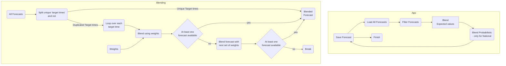

# UK PV Forecast Blend

This app is for blending forecast together

The main application (forecast_blend/app.py)
1. Loads different forecasts 
2. Blends them together using weights
3. Saves them ready to be used by the api
4. This is done for all GSPs

This was previously done in the API

We always update the ForecastValueLatest table, 
but we only update the ForecastValue table every 30 minutes

# Details

The blend is created by choosing the intraday model with the lowest expected MAE (whilst also 
considering the delay to each model run). This intraday model is blended into PVNet-DA unless 
PVNet-DA has a lower expect MAE in which case no intraday model is selected. This is then blended 
into National_XG if needed - but this should rarely be the case



## Environment Variables

- `DB_URL`: The database url you want to save the results to
- `N_GSP`: The number of gsps you want to pull. N_GSP=1 means only National is run. 
- `BLEND_NAME`: The model name to save the blend under. Defaults to `"blend"`.
- `ALLOW_CLOUDCASTING`: Whether to allow `"pvnet_cloud"` to be part of the blend.

# Tests

Tests are in the tests folder and can be run using pytest

Might need to 
```
export PYTHONPATH=${PYTHONPATH}:./forecast_blend
```
