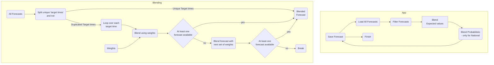

# UK PV Forecast Blend

This app is for blending forecast together

The main application (forecast_blend/app.py)
1. Loads different forecasts 
2. Blends them together using weights
3. Saves them ready to be used by the api
4. This is done for all GSPs

This was previously done in the API

We always update the ForecastValueLatest table, 
but we only update the ForecastValue table every 30 minutes

# Details

- Note we only blend forecasts if they are made within 6 hours. 
If all forecasts are older than this, then all forecasts are used.
- The probabilistic forecasts are now blended using the same method as the expected value
- We current take `Pvnet`, then blend it with `PVnet DA`. `PVnet ECMWF` is used as a backup, and final `National-xg` is a final backup. 



## Environment Variables

- `DB_URL`: The database url you want to save the results to
- `N_GSP`: The number of gsps you want to pull. N_GSP=1 means only National is run. 

# Tests

Tests are in the tests folder and can be run using pytest

Might need to 
```
export PYTHONPATH=${PYTHONPATH}:./forecast_blend
```
